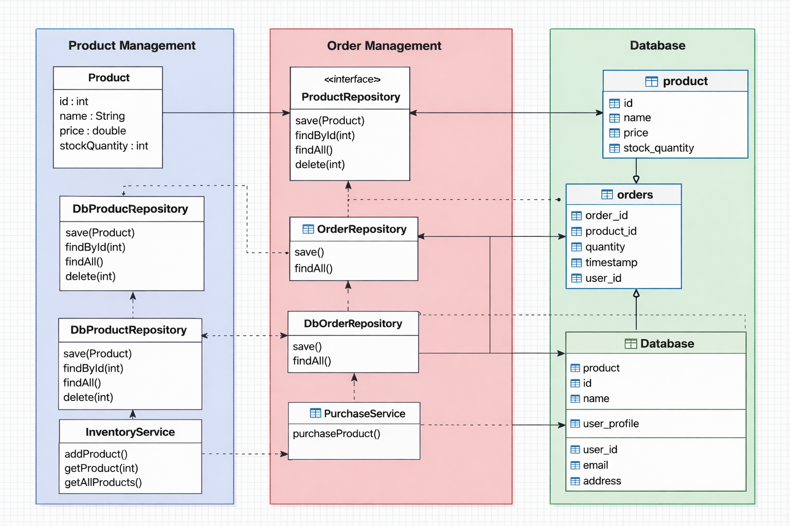

# Divide and Conquer - RetailPulse System

## Overview
The RetailPulse system is divided into independent subsystems to simplify development and allow parallel implementation.

---

## Subsystems

### 1. Product Management (Inventory Subsystem)
Responsible for managing products and stock.

**Responsibilities:**
- Add new products
- Update product details
- Delete products
- View all products
- Manage stock quantity

**User Stories:**
- As a user, I want to add a product so that it can be sold
- As a user, I want to view all products
- As a user, I want to update product details
- As a user, I want to delete a product

---

### 2. Order Management (Purchase Subsystem)
Responsible for handling product purchases and orders.

**Responsibilities:**
- Purchase a product
- Create orders
- Track order details
- Validate stock before purchase

**User Stories:**
- As a user, I want to purchase a product
- As a user, I want to view orders
- As a system, I should prevent purchase if stock is insufficient

---

### 3. Flash Sale / Concurrency Subsystem
Responsible for handling high-concurrency purchase scenarios.

**Responsibilities:**
- Simulate multiple users purchasing simultaneously
- Ensure thread-safe stock updates
- Track success and failure of orders

**User Stories:**
- As a system, I want to handle multiple users buying simultaneously
- As a system, I want to ensure stock consistency
- As a user, I want to know if my purchase succeeded or failed

---

## Subsystem Assignment

| Subsystem | Responsibility | Assigned |
|----------|--------------|---------|
| Product Management | Inventory handling | Self |
| Order Management | Purchase flow | Self |
| Flash Sale | Concurrency handling | Self |

---

## Conclusion

The system is divided into three logical subsystems:
- Product Management
- Order Management
- Flash Sale Management

This separation improves modularity, scalability, and maintainability.